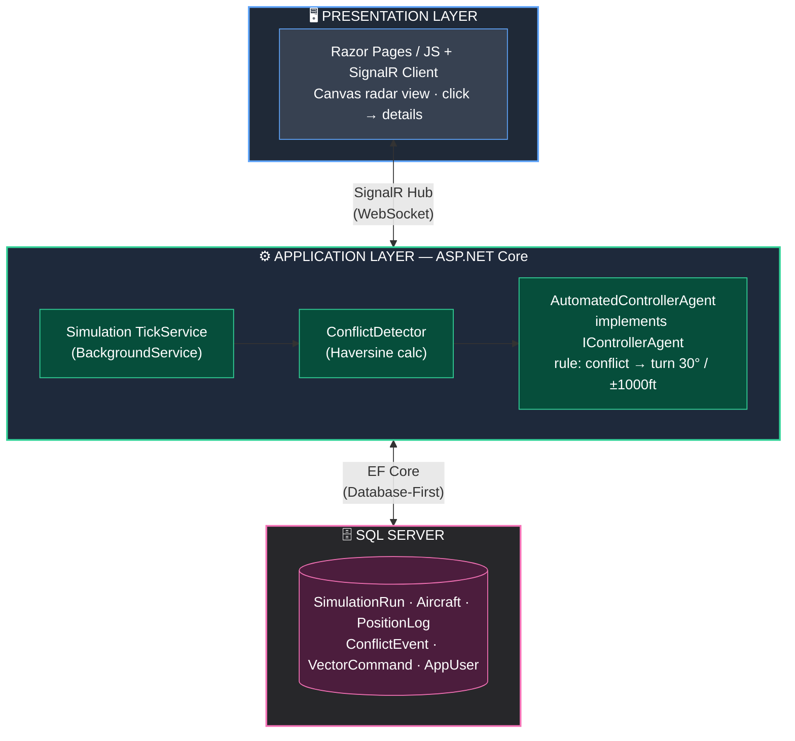
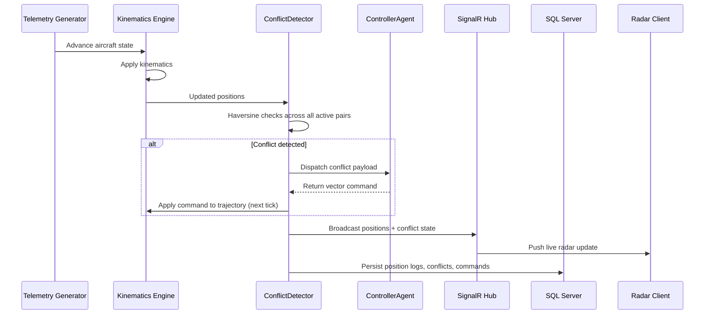
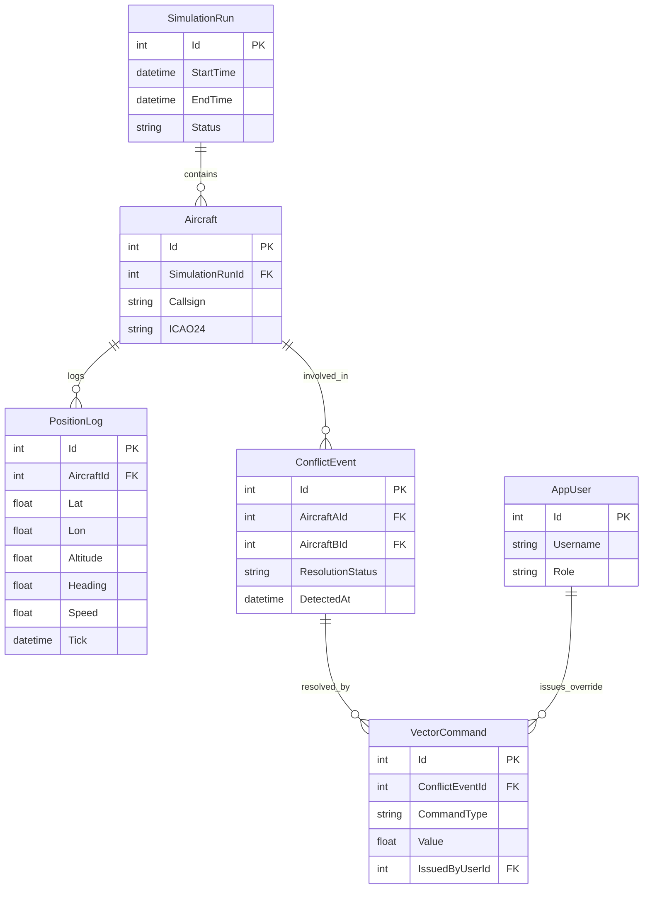

# ✈️ Automated Air Traffic Control (ATC) Simulation & Testing Framework

> A safe, sprint-realistic simulation platform for testing automated ATC conflict-resolution algorithms — without risking real aircraft.

[](https://dotnet.microsoft.com/)
[](https://dotnet.microsoft.com/apps/aspnet)
[](https://dotnet.microsoft.com/apps/aspnet/signalr)
[](https://learn.microsoft.com/ef/core/)
[](https://www.microsoft.com/sql-server)
[](https://xunit.net/)
[]()

---

## 📖 Overview

Testing algorithm-driven ATC vectoring in live airspace is dangerous and non-viable. Existing flight simulators are typically disconnected from the automated resolution engines researchers actually want to validate.

This project builds a **two-layer software framework** — a **Simulation Engine** and a **Control Layer** — that:

- 📡 Ingests simulated flight telemetry (ADS-B-format JSON)
- 🧮 Calculates real-time flight kinematics on a fixed tick
- ⚠️ Detects horizontal/vertical separation conflicts between aircraft
- 🤖 Dispatches conflicts to an automated controller agent and tests its tactical vectoring decisions
- 🖥️ Visualizes everything live on a 2D radar view
  > **📝 Note:** This implementation is intentionally scoped for a **7-member team** delivering in a **9–10 day sprint**. See [Scope Realignment](#-scope-realignment) for why the numbers differ from the original spec — every requirement is preserved, just resized to be honestly buildable.

---

## 👥 Team — Group 26

| Roll No.   | Name               |
| ---------- | ------------------ |
| IN26011871 | Shriyam Rastogi    |
| IN26012122 | Arnav Majithia     |
| IN26011732 | Harsh Kumar Nimesh |
| IN26009582 | Harsh Raj Singh    |
| IN26009579 | Aman Kumar Singh   |
| IN26009732 | Aditya Atreya      |
| IN26011664 | Aryaman Singh      |

---

## 🧱 Tech Stack

| Layer                     | Technology                                             |
| ------------------------- | ------------------------------------------------------ |
| **Backend**               | ASP.NET Core Web API (.NET 8)                          |
| **Real-time layer**       | SignalR (WebSocket hub for radar push updates)         |
| **Database**              | SQL Server (LocalDB / Express)                         |
| **ORM**                   | EF Core — Database-First (`Scaffold-DbContext`)        |
| **Frontend**              | Razor Pages / lightweight JS + HTML5 Canvas radar view |
| **Background processing** | `IHostedService` / `BackgroundService` tick loop       |
| **Testing**               | xUnit (conflict-detection logic)                       |
| **Distance calculation**  | Haversine formula (spherical geodesy)                  |
| **API docs / testing**    | Swagger (OpenAPI, auto-generated)                      |

---

## 🎯 Scope Realignment

The original specification was written at aviation-industry production scale. We've scaled the **constants**, not the **ambition** — every functional requirement, user story, and acceptance criterion is preserved.

| Original Spec                                 | Sprint-Realistic Build                      | Why                                                                                              |
| --------------------------------------------- | ------------------------------------------- | ------------------------------------------------------------------------------------------------ |
| 500 simultaneous aircraft, <100ms tick        | 15–30 aircraft, ~1s tick                    | Still demonstrably real-time; achievable without dedicated load-testing infra                    |
| WGS84 ellipsoidal precision to 0.01 NM        | Haversine (spherical) distance              | Matches project's own traceability plan; sufficient precision for simulation                     |
| Live ADS-B telemetry ingestion                | Simulated JSON generator (identical schema) | No API keys/rate limits needed; a real feed can be swapped in later with zero downstream changes |
| External "Automated Controller Agent" service | Internal C# service via `IControllerAgent`  | Swappable for a real external agent later without touching the rest of the system                |
| 99.9% uptime, multi-hour runs                 | Stable through demo-length runs (10–20 min) | No infra needed to prove production SLAs in a course sprint                                      |

---

## 🏗️ System Architecture



### 🔁 Data Flow (per tick)



---

## ✅ Functional Requirements

| #     | Category                         | Scope                                                                                  |
| ----- | -------------------------------- | -------------------------------------------------------------------------------------- |
| **A** | Ingestion & Kinematics Layer     | Simulated ADS-B telemetry ingestion, real-time position/heading/speed updates per tick |
| **B** | Conflict Detection & Management  | Horizontal/vertical separation checks, conflict lifecycle tracking                     |
| **C** | Automated Vectoring & Resolution | Rule-based tactical resolution via `IControllerAgent`, command application             |
| **D** | Analytics & Supervision          | Run history, conflict analytics, supervisor manual override                            |

---

## 🗄️ Database Schema (EF Core Database-First)

Schema is authored directly in SQL Server, then scaffolded into C# models via `Scaffold-DbContext` — **no code-first migrations**.



| Table           | Purpose                                                        |
| --------------- | -------------------------------------------------------------- |
| `SimulationRun` | Tracks each simulation session (start/end time, status)        |
| `Aircraft`      | Aircraft participating in a run (callsign, ICAO24)             |
| `PositionLog`   | Per-tick position history (lat, lon, altitude, heading, speed) |
| `ConflictEvent` | Detected separation violations and their resolution status     |
| `VectorCommand` | Commands issued by the Controller Agent per conflict           |
| `AppUser`       | Authenticated users (Supervisor / Engineer / Analyst roles)    |

```powershell
# Scaffold EF Core models from an existing SQL Server schema
Scaffold-DbContext "Server=.;Database=AtcSimDb;Trusted_Connection=True;" `
  Microsoft.EntityFrameworkCore.SqlServer -OutputDir Models
```

---

## 📡 API Layer

REST endpoints (CRUD) exposed via ASP.NET Core Web API controllers, documented and testable live via Swagger (`/swagger`):

| Method  | Endpoint                             | Description                                     |
| ------- | ------------------------------------ | ----------------------------------------------- |
| `POST`  | `/api/simulationruns`                | Start a new simulation run                      |
| `PATCH` | `/api/simulationruns/{id}/stop`      | Stop an active run                              |
| `GET`   | `/api/simulationruns/{id}/conflicts` | Fetch conflict history for a run                |
| `POST`  | `/api/overrides`                     | Supervisor manual override (authenticated only) |

> ℹ️ SignalR handles the live one-way radar push separately from this request/response API.

---

## 📅 Sprint Timeline (9–10 days)

```mermaid
gantt
    title Sprint Timeline
    dateFormat  X
    axisFormat Day %s

    section Foundation
    Schema design + EF scaffolding, interfaces stubbed :done, d1, 0, 2

    section Build
    Parallel build (engine, agent, hub, frontend) :active, d2, 2, 5

    section Integration
    Integration — real EF-backed data end to end :d3, 5, 7

    section Hardening
    xUnit tests, bug fixes, demo scenario :d4, 7, 8
    Polish, slides, rehearsal :d5, 8, 10
```



> ⚠️ **Critical path:** database schema must not slip past **Day 2** — every other layer depends on the scaffolded models.

---

## 🧩 Team Structure

| Role                                   | Members | Owns                                           |
| -------------------------------------- | :-----: | ---------------------------------------------- |
| DB & EF Core Lead                      |    1    | Schema design, scaffolding, seed data          |
| Simulation Engine & Conflict Detection |    2    | Tick loop, `ConflictDetector.cs`, xUnit tests  |
| Automated Controller Agent             |    1    | `IControllerAgent` rule-based resolution logic |
| SignalR Hub & API Layer                |    1    | Real-time broadcasts, REST endpoints           |
| Frontend & Radar Visualization         |    2    | Canvas radar, SignalR client, run-control UI   |

---

## 📜 License

No License
